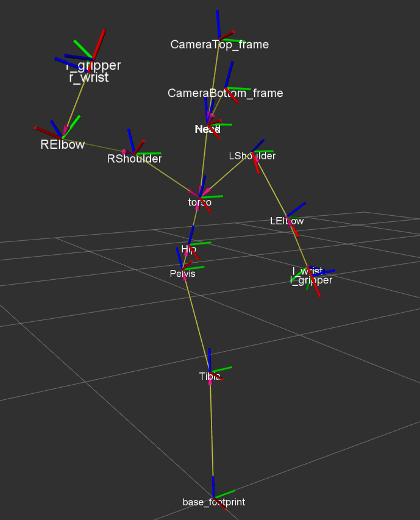
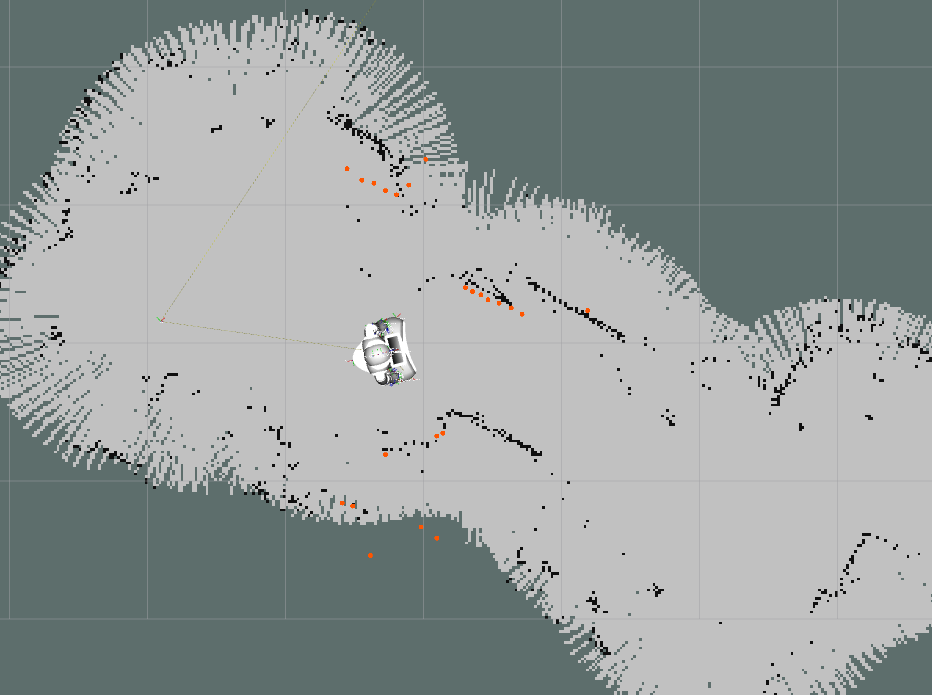
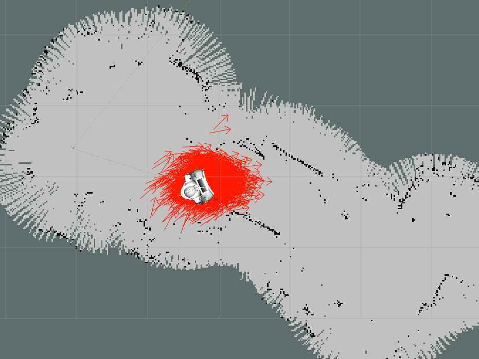
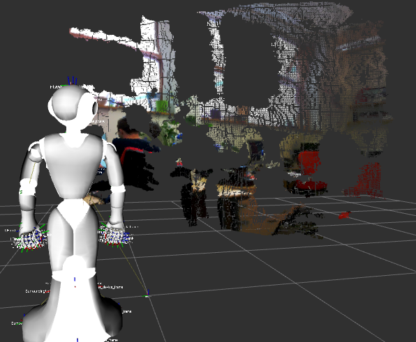
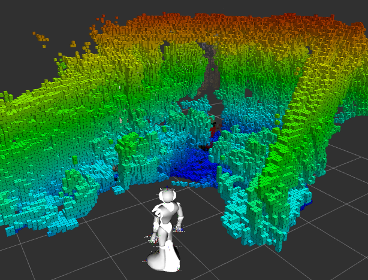

Plymouth's Pepper ROS nodes
===========================

Bringing it up
--------------

- ``export NAO_IP=<pepper IP>``
- ``ssh nao@<pepper IP>``, then:
```
$ nao stop
$ naoqi-bin --disable-life
```
- ``ssh nao@<pepper IP>``, then:
```
qicli call ALMotion.wakeUp
```

Finally:
```
roslaunch pepper_bringup pepper_full.launch
```



Teleop
------

Required packages:
- ``ros-<version>-joy``
- ``nao_teleop``: [http://wiki.ros.org/nao_teleop](http://wiki.ros.org/nao_teleop)

Then:
```
$ roslaunch nao_teleop teleop_joy.launch
```

Note: to enable the joystick control, press button **10** on the joystick, not
9.

Mapping
-------



Using `gmapping`:

```
$ roslaunch pepper_plymouth_nao mapping.launch
```

Localisation
------------



First, the map server:

```
$ rosrun map_server map_server <path to map>/map.yaml
```

Then, AMCL:
```
$ rosrun amcl amcl scan:=/pepper_robot/laser
```

To save the map, run:
```
$ rosrun map_server map_saver
```
**before** stopping ``gmapping``.


Navigation
----------


Both localisation (using `AMCL`) and planning are provided from:

```
roslaunch pepper_plymouth_ros nav.launch
```

A custom map can be provided:

```
roslaunch pepper_plymouth_ros nav.launch map:=<full path to your map.yaml>
```

3D Perception
-------------



Until it is officially released, you might need to manually install ``pepper_bringup`` with the perception
launch file: [get it here](https://github.com/ros-naoqi/pepper_robot/pull/27).

Then it works 'out of the box'.

Building a 3D voxel octomap
---------------------------



You need the 3D perception pipeline up and running. See above.

- First:
``` 
$ sudo apt install ros-kinetic-octo*
```

- then install by hand [octomap_mapping](https://github.com/OctoMap/octomap_mapping)
- then:
```
$ roslaunch pepper_plymouth_ros octomap_mapping.launch
```

